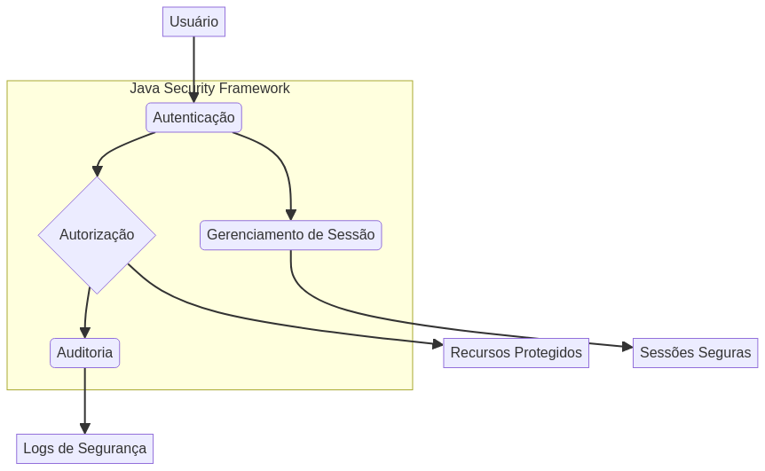

# Java-Security-Framework

**Enterprise Security Management Framework**

## 🖼️ Imagem Hero / Hero Image



---

## Descrição / Description

Este projeto apresenta um **Framework de Gerenciamento de Segurança Empresarial** construído com Java Spring Boot. Ele fornece uma base robusta para implementar funcionalidades de segurança em aplicações corporativas, incluindo autenticação, autorização, gerenciamento de sessão e auditoria.

This project presents an **Enterprise Security Management Framework** built with Java Spring Boot. It provides a robust foundation for implementing security features in enterprise applications, including authentication, authorization, session management, and auditing.

---

## Início Rápido / Quick Start

Para executar a aplicação localmente, siga os passos abaixo:

To run the application locally, follow these steps:

```bash
mvn spring-boot:run
```

---

## Autor / Author

Gabriel Demetrios Lafis

---

## Licença / License

Este projeto está licenciado sob a licença MIT. Veja o arquivo [LICENSE](LICENSE) para mais detalhes.

This project is licensed under the MIT License. See the [LICENSE](LICENSE) file for more details.

